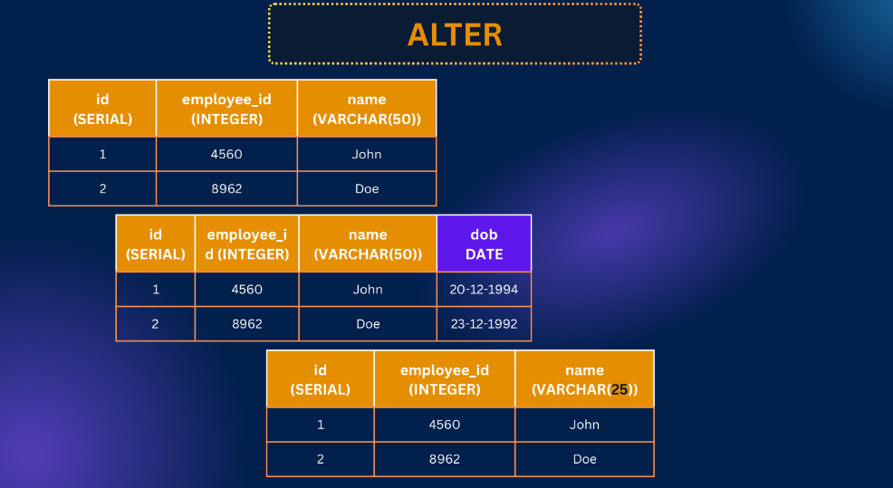
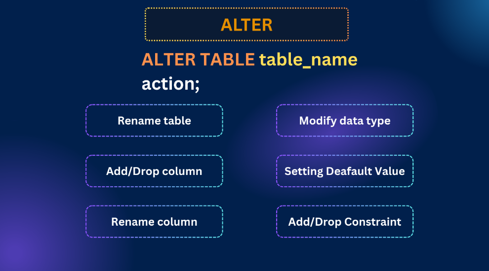

# Postgresql-Advance-Data-Manipulation-Techniques

Slide Link: https://drive.google.com/file/d/1s5VPi8b89d1zs8JvzWS_juDyB4-8kJF2/view


In this module, we’ll dive into advanced data manipulation techniques in PostgreSQL. You’ll learn how to use ALTER for modifying tables and constraints, work with default values and column rules, and master filtering data using WHERE, AND, OR, BETWEEN, IN, LIKE, and ILIKE. We’ll also explore scalar functions and finish with powerful aggregate functions like COUNT, SUM, and AVG. By the end, you’ll be confident in writing more efficient and professional SQL queries.

## 45-1 ALTER Table & Constraints
- Alter is for modifying a table (modifying existing object of a database) like we need an extra column, like we need to change a data type of a table column



### What we can do using alter?

- Rename Table
- Add/drop column
- Rename Column 
- Modify Data type 
- Setting Default value 
- Add/drop Constrain 



- create a table 

```sql
create table employee (
  id serial,
  name varchar(50),
  age int
);
```
- change the table name 

```sql
alter table employees rename to employee
```

- add column 

```sql
alter table employee 
  add column email varchar(50)
  

```

- drop a column 

```sql
alter table employee 
  drop column email;
```

- rename a column name 

```sql
alter table employee
  rename column name to user_name;
```

- modify a constrain 

```sql
alter table employee 
  alter column user_name type varchar(50) 
```

- add a new constrain to a column 

```sql
alter table employee 
  alter column email set not null
```

- drop a constrain

```sql
alter table employee 
  alter column email drop not null
```